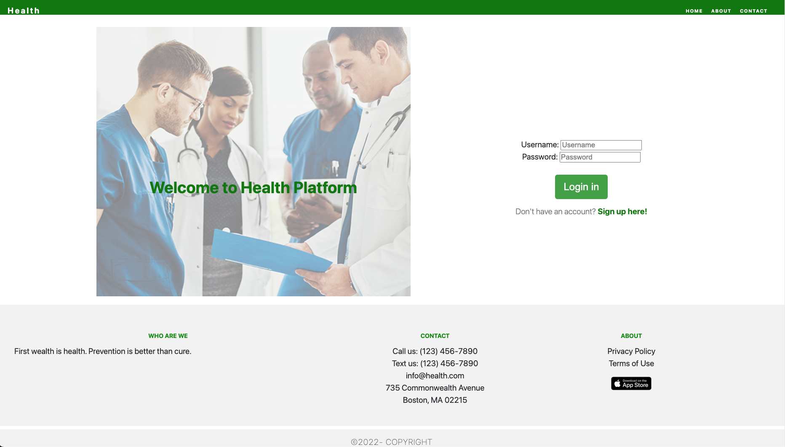
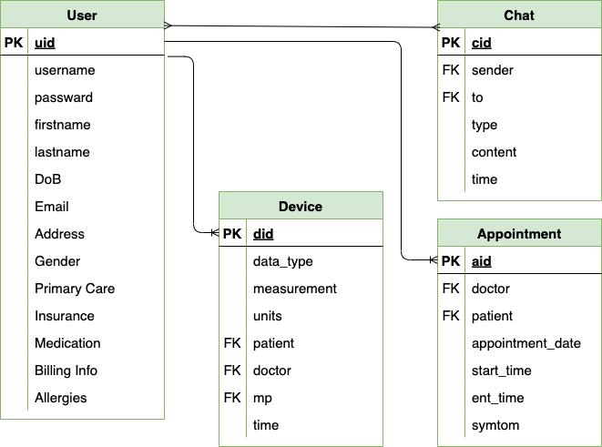

# Patient Gateway
## Product Mission

A Remote Health Application System provides a platform where patients can manage their medical data, make appointments, and query with doctors. 
Meanwhile, medical professionals can also manage their appointments, assign examination with devices, updates patient results, and communicate with them.

## User Stories

- I, the admin, should be able to add a patient, doctor, or nurse. I can manage events on the calendar and add devices to the system.
- I,  the medical professional, have a calendar that I can maintain, show when I can have appointments, and manage all aspects of my calendar.
- I, the medical professional, should be able to input all my patients' vitals and assign a set of IoT devices to the patient where the devices can automatically update the patient's Vitals.
- I, the patient, should be able to make an appointment with my doctor and edit it. I can leave voice or video messages to the doctor.
- I, an AI developer, should be able to access the data anonymized. 

## Branches

Main branch: release ready code.

Module branches: module branches to add and implement new feature. After passing the test, merged into the main branch.

## API

| Page                | Endpoint            | Method |
| ------------------- | ------------------- | ------ |
| index               | /                   | [GET]  |
| login               | /login              | [POST] |
| register            | /register           | [POST] |
| mian                | /main               | [POST] |
| user                | /user/<user_id>     | [POST] |
| add user            | /user/add/<user_id> | [POST] |
| add device data     | /device/<user_id>   | [POST] |
| send chat           | /chat/<user_id>     | [POST] |
| get chat history    | /chat/history/<>    | [GET]  |
| delete chat history | /chat/del           | [POST] |

## Components

##### Login page

### 1. Device Module

Define Interface for devices to ingest data into the system

##### Data Fields 

(including knowing how to attribute the data to a patient)

Include Temperature, blood pressure, pulse, oximeter, weight and Glucometer and data your system can handle

##### Error Conditions

##### Pull or Push mechanisms

Push mechanisms. Once the results or updates come out, they can be sent out immediately.

**Database schema**

### 2. Chat Module

one-on-one chat
