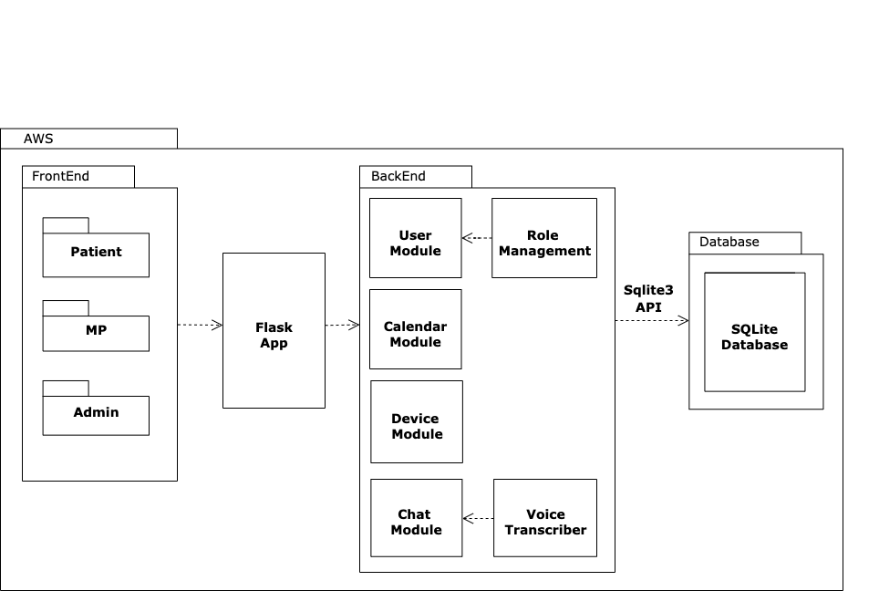
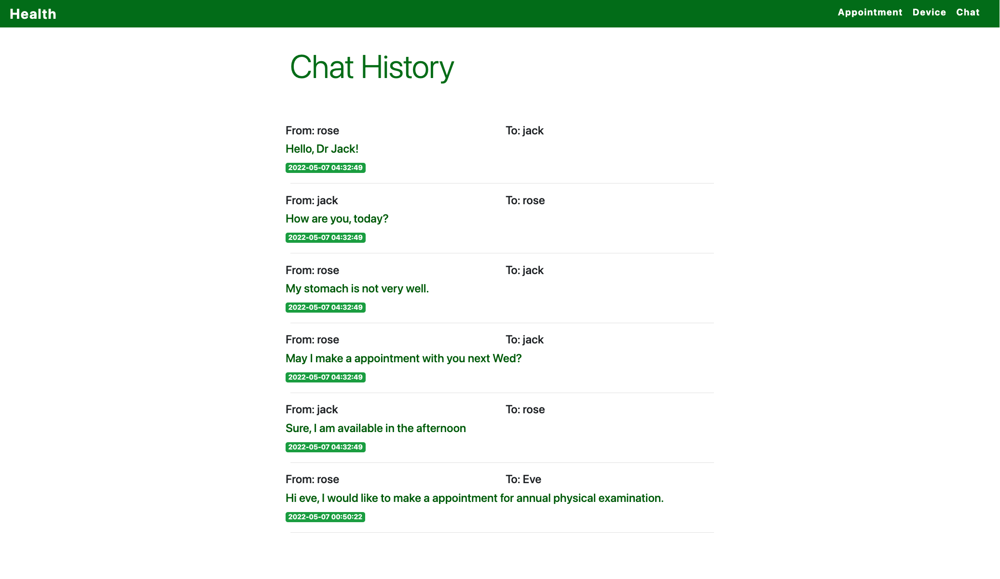
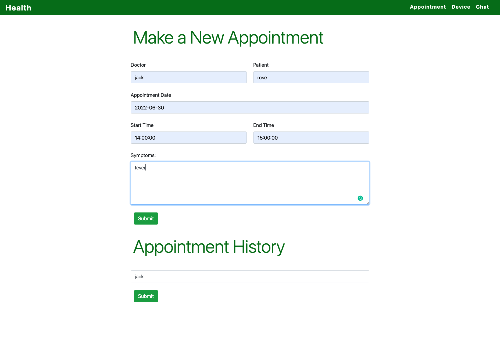
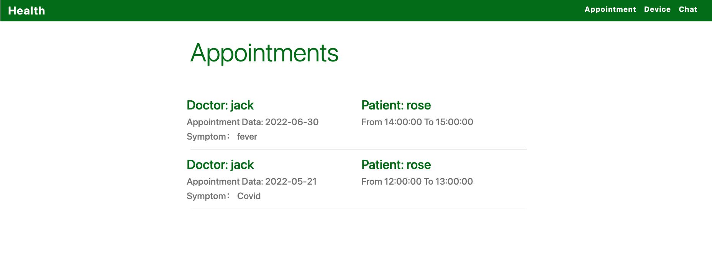

# Patient Gateway
## Product Mission

A Remote Health Application System provides a platform where patients can manage their medical data, make appointments, and query with doctors. 
Meanwhile, medical professionals can also manage their appointments, assign examination with devices, updates patient results, and communicate with them.

## User Stories

- Administrators
  - Add users to the system and change their roles ('admin', 'doctor', 'nurse', 'patient', 'family', 'developer').
  - Add devices to the system and modify devices (add, enable, disable, remove).
  - Add data and modify data.
  - Manage events on the calendar.
- Medical professionals (nurses and doctors)
  - Browse patients data.
  - Assign devices to patients.
  - Enter medical data for patients. 
  - Chat with patients.
  - Access transcriptions of  patients' video or voice messages.
  - Manage their appointements calendar.
- Patients
  - Edit account profile.
  - Access their medical measurements.
  - Communicate with health provider via text, video or voice message.
  - Schedule appointments with their health provider and edit them.
- Developers
  - access anonymized data.

## Branches

Main branch: release ready code.

Module branches: module branches to add and implement new feature. After passing the test, merged into the main branch.

## API

| Page                    | Endpoint                    | Method   |
| ----------------------- | --------------------------- | -------- |
| index                   | /                           | [GET]    |
| login                   | /login                      | [POST]   |
| register                | /register                   | [POST]   |
| main                    | /main                       | [POST]   |
| user                    | /user/<user>                | [POST]   |
| add user                | /user/add/<user>            | [POST]   |
| delete user             | /user/del/<user>            | [DELETE] |
| add device data         | /device/<user>              | [POST]   |
| delete device data      | /device/del/<user>          | [POST]   |
| send chat               | /chat/<user>                | [POST]   |
| get chat history        | /chat/history/<user>        | [GET]    |
| delete chat history     | /chat/del/<c_id>            | [POST]   |
| make appointment        | /appointment/<user>         | [POST]   |
| get appointment history | /appointment/history/<user> | [GET]    |
| delete chat history     | /chat/del/<a_id>            | [POST]   |

## Components

##### Login page

Register page

### 1. Device Module

Define Interface for devices to ingest data into the system

##### Data Fields 

- Data types and units:
  - Temperature: ("C", "F")
  - Weight: ("kgs", "lbs")
  - Pulse:("bpm")
  - Systolic blood pressure: ("mmHg")
  - Diastolic blood pressure: ("mmHg")
  - Glucose level: ("mg/dL")
  - Oxygen level: (%)

- Error Conditions:

  - Invalid key

  - Invalid device type

  - Invalid units for device

  - Invalid measurements

##### Pull or Push mechanisms

Push mechanisms. Once the results or updates come out, they can be sent out immediately.

**Database schema**

### 2. Chat Module

The Chat Module allows patients to communicate with health providers via text, video, or voice message.

The screenshot below shows the chat module.

The screenshot below shows the chat history, which stored in the SQLite database.

### 3. Calendar Module

Patients and medical providers can make appointments with each other and manage the appointments on the calendar, like edit and delete them.

